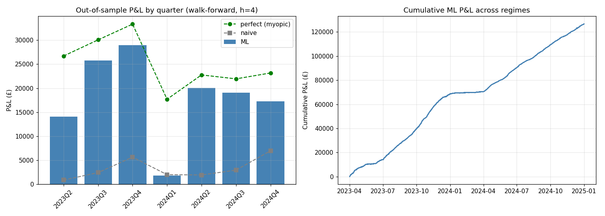
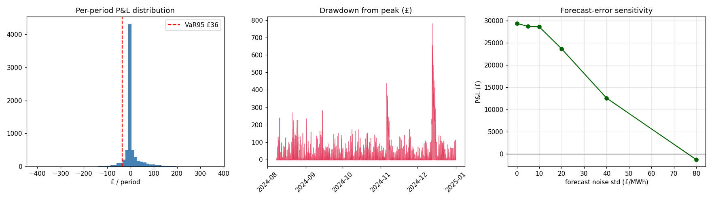

# Battery Energy Storage Trading & Arbitrage Strategy — Results

*A quantitative trading strategy for short-term UK electricity markets: forecast
price/imbalance opportunities, convert forecasts into battery charge/discharge decisions
under realistic operating constraints, and evaluate the risk-adjusted commercial outcome.*

The question the whole project is built to answer is **not** "how accurate is the price
forecast?" but **"does the forecast produce a commercially useful trading signal after
constraints, costs and risk?"**

---

## 1. Setup

| | |
|---|---|
| **Market** | GB electricity imbalance (cash-out) prices, via the Elexon BMRS Insights API |
| **Data** | 2 years, 2023–2024, half-hourly (≈35,000 settlement periods) |
| **Signals** | System Sell/Buy Price (DISEBSP), transmission demand (ITSDO), and fundamental drivers: wind, net interconnector flow, gas/CCGT (FUELINST) |
| **Asset** | 2 MWh / 1 MW battery (0.5C), 95% one-way efficiency (~90% round-trip), min/max SoC 5–95%, £2/MWh degradation, £0.5/MWh transaction cost |
| **Evaluation** | Strictly out-of-sample: features look backward, the label looks forward, splits are chronological, and tuning happens on a validation window never touched by the test |

## 2. Method — an eight-step pipeline

```
market data → drivers → probabilistic forecast → decision → optimisation → P&L → walk-forward robustness → risk analysis
```

1. **Forecast (Stage 1).** A random forest predicts the forward price change over a tuned
   horizon; a companion classifier estimates *P(next period offers a tradeable move)*.
2. **Drivers (Stage 2).** Wind (level/lag/ramp), interconnector flow and gas are merged and
   engineered as features. Wind correlates −0.23 with price, as expected.
3. **Decision (Stage 3).** Forecasts are converted to an expected round-trip **edge**;
   trades fire only when the edge clears a commercial gate, with optional confidence sizing.
4. **Simulation.** A constraint-respecting simulator (capacity, SoC, power, efficiency,
   costs, degradation) produces a mark-to-market equity curve.
5. **Optimisation (Stage 3).** A perfect-foresight **LP** gives the true optimal dispatch
   (upper bound); a receding-horizon **MPC** feeds forecasts into the same LP causally.
6. **Commercial outcome (Stage 4).** P&L, £/MWh, Sharpe vs benchmarks.
7. **Robustness (Stage 4).** Expanding-window walk-forward across every quarter.
8. **Risk (Stage 5).** Tail metrics, forecast-error sensitivity, regime stress.

## 3. Headline results

### Multi-regime robustness (walk-forward, 2 years)
Train on all prior data, test on each quarter, out-of-sample.

| metric | value |
|---|---|
| Profitable quarters | **7 / 7** |
| Beats naïve baseline | 6 / 7 |
| ML total P&L | **£126,982** |
| LP optimum (true ceiling) | £224,967 |
| **Capture of the optimum** | **56%** |
| Mean quarter Sharpe | 13.2 |
| Worst quarter | 2024Q1 (£1,818; 8% capture) |



The strategy sits between the naïve floor and the LP ceiling in every quarter; the
cumulative curve rises steadily with a visible flat spot in the weak 2024Q1 regime.

### Strategy comparison (single tuned test window)

| strategy | P&L | Sharpe | note |
|---|---|---|---|
| LP optimum | £48,013 | 24.8 | perfect-foresight upper bound |
| Perfect-foresight myopic | £37,120 | 19.6 | reference, not a bound |
| **ML forecast (tuned heuristic)** | **£30,057** | 16.3 | the deployed strategy |
| MPC (forecast + rolling LP) | £9,907 | 5.7 | see finding below |
| Naïve time-of-day | £9,346 | 3.9 | zero-forecast baseline |

### Risk profile (Stage 5)

| | |
|---|---|
| Sharpe / Sortino | ~16 / ~21 |
| VaR₉₅ / CVaR₉₅ (per period) | £37 / £69 |
| Max drawdown / duration | 0.6% / ~166 periods |
| P&L distribution | right-skewed (skew +1.4, excess kurtosis 13) |
| Exposure | trades ~87% of periods |



## 4. Findings that matter more than the P&L

**1. Complexity does not automatically create value.** The receding-horizon MPC — the most
sophisticated policy — *underperformed the simple edge heuristic* and barely beat naïve.
Feeding a **point** forecast into an optimiser makes it over-confident: it commits fully to
forecast paths that are wrong, and the errors compound. With a *perfect* forecast the same
MPC reaches the LP optimum (verified), so the machinery is right — the limitation is
forecast quality, not the optimiser. The lesson: **optimisation only pays once the forecast
is good and its uncertainty is respected.**

**2. Forecast accuracy ≠ P&L, quantified.** Injecting Gaussian noise into the forecast
degrades P&L smoothly to zero at ~£80/MWh of noise — a direct, monetised measure of how
much the strategy leans on forecast quality.

**3. The money is in the spikes.** Price-spike periods are 15% of the sample but generate
~64% of realised P&L. The strategy is, in effect, a spike-capture engine.

**4. Fundamentals add little *short-term*.** Wind/gas/interconnector features barely move
P&L over price/demand/time on these windows — the imbalance price is highly
autoregressive, so recent price dominates. An honest null result worth re-testing across
more regimes and with richer drivers (solar, weather, outages).

**5. Read realised cash, not mark-to-market.** Negative-price periods first appeared to
lose money; decomposition showed the strategy correctly charges (is *paid* to consume) for
**positive realised cash**, and the apparent loss was transient inventory revaluation. A
reminder that P&L attribution must separate realised from unrealised.

## 5. Limitations

- One battery configuration; £ figures scale with size/power.
- Two years of one market (GB); results should be re-tested across more regimes.
- The deployed policy is a heuristic; the forecast is a point estimate, not a calibrated
  distribution; the horizon is fixed (tuned once, not per regime).
- Backtest, not live: no real-time data latency, execution, or settlement reconciliation.

## 6. Next steps

1. **Robust/stochastic MPC** — respect forecast uncertainty (shrink far horizons, chance
   constraints) to close the ML→LP gap; the single biggest performance lever.
2. **Probabilistic forecast calibration** — use *P(tradeable move)* with proper calibration
   and size positions by confidence.
3. **Richer drivers + attribution** — solar, weather, outages, and SHAP to explain *why* a
   move is predicted.
4. **Risk extensions** — VaR term structure and explicit extreme-scenario replays.

---

*Reproduce: `pip install -r requirements.txt`, `python fetch_bmrs.py --from … --to …`, then
`python backtest.py` (single window), `python robustness.py` (walk-forward), `python
risk.py` (risk report). Pipeline plumbing is verified on synthetic data in `tests/`.*
